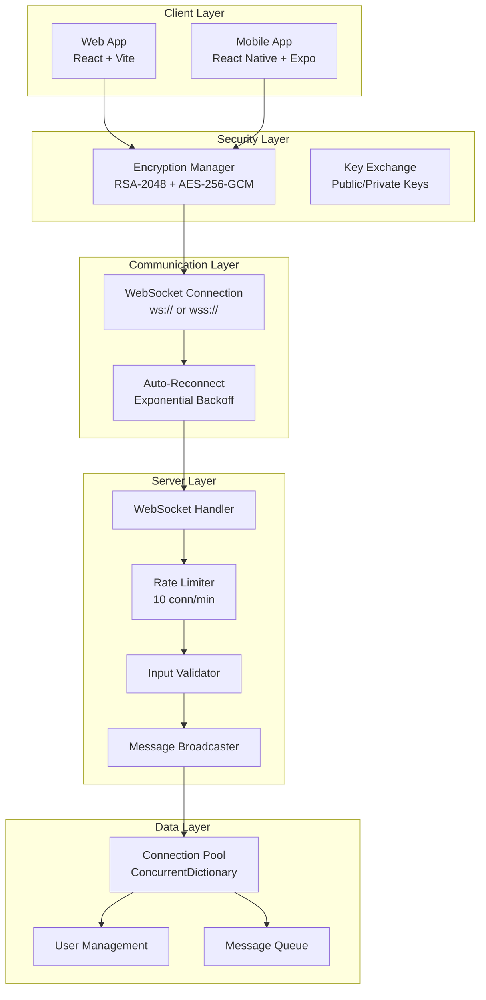

# 🏗️ Architettura PieraChat v2.0

## Panoramica Sistema

PieraChat è un'applicazione di chat real-time con crittografia end-to-end costruita su un'architettura client-server WebSocket.

```
┌─────────────────────────────────────────────────────────────┐
│                     PIERACHAT v2.0                          │
│          Secure Real-Time Chat Platform                     │
└─────────────────────────────────────────────────────────────┘

┌──────────────┐      ┌──────────────┐      ┌──────────────┐
│  Web Client  │      │Mobile Client │      │ iOS Client   │
│   (React)    │      │(React Native)│      │(React Native)│
└──────┬───────┘      └──────┬───────┘      └──────┬───────┘
       │                     │                      │
       │          WebSocket (wss://)                │
       └─────────────────────┼──────────────────────┘
                             │
                    ┌────────▼─────────┐
                    │   Load Balancer  │
                    │   (Optional)     │
                    └────────┬─────────┘
                             │
                    ┌────────▼─────────┐
                    │  Backend Server  │
                    │   (.NET 8 C#)    │
                    │                  │
                    │  - WebSocket     │
                    │  - Rate Limiting │
                    │  - Validation    │
                    └──────────────────┘
```

## Stack Tecnologico

### 🎨 Frontend Web
- **Framework**: React 18.2
- **Build Tool**: Vite 5.0
- **Styling**: Tailwind CSS 3.3
- **Icons**: Lucide React
- **WebSocket**: Native WebSocket API
- **Crittografia**: Web Crypto API

### 📱 Mobile (React Native)
- **Framework**: React Native 0.73 + Expo 50
- **UI Library**: React Native Paper 5.12
- **Navigation**: React Navigation 6
- **Crittografia**: Expo Crypto
- **Storage**: Expo Secure Store

### ⚙️ Backend
- **Runtime**: .NET 8 / ASP.NET Core
- **WebSocket**: System.Net.WebSockets
- **Serialization**: System.Text.Json
- **Hosting**: Kestrel HTTP Server

## Diagramma Architetturale Dettagliato



## Flusso Comunicazione

### 1️⃣ Connessione Iniziale

```
┌──────────┐                                   ┌──────────┐
│  Client  │                                   │  Server  │
└─────┬────┘                                   └─────┬────┘
      │                                              │
      │  1. WebSocket Handshake                     │
      ├─────────────────────────────────────────────>│
      │     Upgrade: websocket                       │
      │                                              │
      │  2. Connection Established                   │
      │<─────────────────────────────────────────────┤
      │     HTTP 101 Switching Protocols             │
      │                                              │
      │  3. Generate RSA Key Pair                    │
      │     (2048-bit)                               │
      │                                              │
      │  4. JOIN Message + Public Key                │
      ├─────────────────────────────────────────────>│
      │     {                                        │
      │       type: "join",                          │
      │       username: "Alice",                     │
      │       publicKey: "BASE64..."                 │
      │     }                                        │
      │                                              │
      │                                     5. Validate Username
      │                                     6. Check Duplicates
      │                                     7. Store Connection
      │                                              │
      │  8. USERS List + Public Keys                 │
      │<─────────────────────────────────────────────┤
      │     {                                        │
      │       type: "users",                         │
      │       users: [                               │
      │         {username: "Bob", publicKey: "..."}  │
      │       ]                                      │
      │     }                                        │
      │                                              │
      │  9. Store Other Users' Public Keys           │
      │                                              │
```

### 2️⃣ Invio Messaggio Crittografato

```
┌──────────┐                                   ┌──────────┐
│  Alice   │                                   │  Server  │
└─────┬────┘                                   └─────┬────┘
      │                                              │
      │  1. Generate AES-256 Session Key             │
      │     (Random 256-bit key)                     │
      │                                              │
      │  2. Encrypt Message with AES-GCM             │
      │     Message: "Hello Bob!"                    │
      │     -> EncryptedMsg + IV                     │
      │                                              │
      │  3. Encrypt AES Key with Each User's         │
      │     RSA Public Key                           │
      │     -> {Bob: EncKey1, Carol: EncKey2}        │
      │                                              │
      │  4. MESSAGE with Encrypted Package           │
      ├─────────────────────────────────────────────>│
      │     {                                        │
      │       type: "message",                       │
      │       encryptedMessage: {                    │
      │         encryptedMessage: "BASE64...",       │
      │         iv: "BASE64...",                     │
      │         encryptedKeys: {                     │
      │           Bob: "...",                        │
      │           Carol: "..."                       │
      │         }                                    │
      │       }                                      │
      │     }                                        │
      │                                              │
      │                                     5. Validate
      │                                     6. Add Metadata
      │                                              │
      │                                     7. Broadcast to All
      │                                              ├──> Bob
      │                                              ├──> Carol
      │                                              └──> Alice
```

### 3️⃣ Ricezione e Decrittazione

```
┌──────────┐                                   ┌──────────┐
│   Bob    │                                   │  Server  │
└─────┬────┘                                   └─────┬────┘
      │                                              │
      │  1. Receive Encrypted Message                │
      │<─────────────────────────────────────────────┤
      │                                              │
      │  2. Extract Encrypted AES Key for "Bob"      │
      │     encryptedKeys.Bob                        │
      │                                              │
      │  3. Decrypt AES Key with RSA Private Key     │
      │     -> AES Session Key                       │
      │                                              │
      │  4. Decrypt Message with AES Key + IV        │
      │     -> "Hello Bob!"                          │
      │                                              │
      │  5. Display Message                          │
      │                                              │
```

## Gestione Connessioni

### Connection Pool

```
ConcurrentDictionary<ConnectionId, ConnectionInfo>

ConnectionInfo {
  WebSocket socket
  string username
  string publicKey
  DateTime joinedAt
}
```

### Rate Limiting

```
ConcurrentDictionary<ClientIP, RateLimitInfo>

RateLimitInfo {
  int count          // Connessioni tentate
  DateTime firstRequest
}

Limite: 10 connessioni per minuto per IP
```

### Auto-Reconnection (Client)

```
Attempt 0: Immediate
Attempt 1: 1 second delay
Attempt 2: 2 seconds delay
Attempt 3: 4 seconds delay
...
Max delay: 30 seconds
```

## Scalabilità

### Architettura Orizzontale (Futuro)

```
                    ┌──────────────┐
                    │ Load Balancer│
                    │   (nginx)    │
                    └───────┬──────┘
                            │
            ┌───────────────┼───────────────┐
            │               │               │
      ┌─────▼─────┐   ┌─────▼─────┐  ┌─────▼─────┐
      │ Server 1  │   │ Server 2  │  │ Server 3  │
      └─────┬─────┘   └─────┬─────┘  └─────┬─────┘
            │               │               │
            └───────────────┼───────────────┘
                            │
                    ┌───────▼────────┐
                    │  Redis PubSub  │
                    │  (Message Bus) │
                    └────────────────┘
```

### Message Persistence (Futuro)

```
┌──────────────┐
│   MongoDB    │
│   or         │
│  PostgreSQL  │
└──────────────┘

Schema:
messages {
  id: UUID
  username: string
  encryptedMessage: binary
  timestamp: datetime
  roomId: UUID
}
```

## Performance Metrics

### Latenza Tipica
- **Connessione**: 50-100ms
- **Invio messaggio**: 10-30ms
- **Broadcast**: 20-50ms
- **Crittografia**: 5-15ms
- **Decrittografia**: 5-15ms

### Limiti
- **Max messaggio**: 8KB crittografato
- **Max connessioni**: Limitato da risorse server
- **Rate limit**: 10 conn/min per IP
- **Buffer size**: 8KB

### Ottimizzazioni
- **Binary WebSocket** per messaggi grandi
- **Message batching** per alta frequenza
- **Connection pooling** lato server
- **Lazy loading** messaggi storici

## Sicurezza

### Livelli di Protezione

1. **Transport Layer**: TLS/SSL (wss://)
2. **Application Layer**: End-to-End Encryption
3. **Input Validation**: Sanitizzazione server-side
4. **Rate Limiting**: Protezione DDoS
5. **Authentication**: Username validation

Vedi [SECURITY.md](SECURITY.md) per dettagli completi.

## Deployment

### Requisiti Sistema

**Server:**
- CPU: 2+ cores
- RAM: 2GB+ (1000 concurrent users)
- Disco: 10GB+
- Network: 100Mbps+

**Client:**
- Browser: Chrome 90+, Firefox 88+, Safari 14+
- Mobile: Android 8+, iOS 12+

### Ambiente Produzione

```bash
# Backend
cd backend/PieraServer
dotnet publish -c Release
./bin/Release/net8.0/publish/PieraServer

# Frontend Web
cd frontend
npm run build
# Deploy dist/ su CDN/hosting statico

# Mobile
cd mobile
eas build --platform all
eas submit
```

## Monitoring & Logging

### Endpoints Diagnostici

- `GET /` - Informazioni server
- `GET /health` - Health check
- `GET /stats` - Statistiche real-time

### Log Format

```
[HH:mm:ss] [LEVEL] Message
[14:30:15] [INFO] User Alice connected from 192.168.1.100
[14:30:16] [MESSAGE] Alice sent encrypted message
[14:30:20] [LEAVE] Alice disconnected
```

### Metriche Chiave

- Connessioni attive
- Messaggi/secondo
- Utenti online
- Memoria utilizzata
- Errori/minuto

## Roadmap Futura

- [ ] Messaggi privati 1-to-1
- [ ] Stanze/canali multipli
- [ ] Persistenza messaggi
- [ ] Upload file/immagini
- [ ] Videochiamate WebRTC
- [ ] Notifiche push
- [ ] Desktop app (Electron)
- [ ] Autenticazione OAuth
