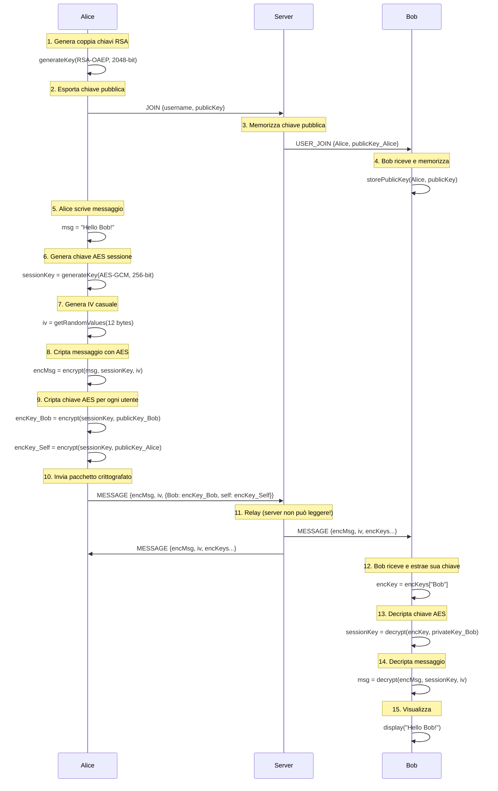

# 🔐 Sicurezza e Crittografia PieraChat

## Panoramica Sicurezza

PieraChat implementa una sicurezza multi-livello con crittografia end-to-end (E2EE), garantendo che solo mittenti e destinatari possano leggere i messaggi.

## Livelli di Sicurezza

```
┌─────────────────────────────────────────────────────────┐
│                   SECURITY LAYERS                        │
└─────────────────────────────────────────────────────────┘

Layer 5: ┌──────────────────────────────────────┐
         │  Input Validation & Sanitization     │
         │  • Username regex validation          │
         │  • Message length limits              │
         │  • JSON schema validation             │
         └──────────────────────────────────────┘

Layer 4: ┌──────────────────────────────────────┐
         │  Rate Limiting & DoS Protection      │
         │  • 10 connections/minute per IP       │
         │  • Automatic IP blocking              │
         │  • Connection throttling              │
         └──────────────────────────────────────┘

Layer 3: ┌──────────────────────────────────────┐
         │  End-to-End Encryption (E2EE)        │
         │  • RSA-2048 key exchange              │
         │  • AES-256-GCM message encryption     │
         │  • Per-message session keys           │
         └──────────────────────────────────────┘

Layer 2: ┌──────────────────────────────────────┐
         │  Transport Layer Security (TLS)      │
         │  • TLS 1.2+ (wss://)                 │
         │  • Certificate validation             │
         │  • Perfect Forward Secrecy            │
         └──────────────────────────────────────┘

Layer 1: ┌──────────────────────────────────────┐
         │  Network Security                     │
         │  • Firewall rules                     │
         │  • CORS policies                      │
         │  • IP whitelisting (optional)         │
         └──────────────────────────────────────┘
```

## Crittografia End-to-End

### Algoritmi Utilizzati

| Componente | Algoritmo | Dimensione | Scopo |
|-----------|-----------|------------|-------|
| **Key Exchange** | RSA-OAEP | 2048-bit | Scambio chiavi sicuro |
| **Message Encryption** | AES-GCM | 256-bit | Crittografia messaggi |
| **Hashing** | SHA-256 | 256-bit | Integrità dati |
| **Random Generation** | Web Crypto API | - | Generazione chiavi/IV |

### Flusso Crittografico Completo



### Esempio Codice Crittografia (JavaScript)

```javascript
// 1. Generazione coppia chiavi RSA
const keyPair = await crypto.subtle.generateKey(
  {
    name: 'RSA-OAEP',
    modulusLength: 2048,
    publicExponent: new Uint8Array([1, 0, 1]),
    hash: 'SHA-256'
  },
  true,
  ['encrypt', 'decrypt']
);

// 2. Generazione chiave AES per messaggio
const aesKey = await crypto.subtle.generateKey(
  {
    name: 'AES-GCM',
    length: 256
  },
  true,
  ['encrypt', 'decrypt']
);

// 3. Crittografia messaggio
const iv = crypto.getRandomValues(new Uint8Array(12));
const encodedMessage = new TextEncoder().encode(message);

const encryptedMessage = await crypto.subtle.encrypt(
  {
    name: 'AES-GCM',
    iv: iv
  },
  aesKey,
  encodedMessage
);

// 4. Crittografia chiave AES con RSA destinatario
const exportedAesKey = await crypto.subtle.exportKey('raw', aesKey);
const encryptedKey = await crypto.subtle.encrypt(
  {
    name: 'RSA-OAEP'
  },
  recipientPublicKey,
  exportedAesKey
);

// 5. Decrittografia (destinatario)
const decryptedAesKey = await crypto.subtle.decrypt(
  {
    name: 'RSA-OAEP'
  },
  myPrivateKey,
  encryptedKey
);

const importedAesKey = await crypto.subtle.importKey(
  'raw',
  decryptedAesKey,
  { name: 'AES-GCM' },
  false,
  ['decrypt']
);

const decryptedMessage = await crypto.subtle.decrypt(
  {
    name: 'AES-GCM',
    iv: iv
  },
  importedAesKey,
  encryptedMessage
);

const message = new TextDecoder().decode(decryptedMessage);
```

## Sicurezza Transport (TLS)

### Configurazione Server HTTPS

```nginx
# nginx.conf
server {
    listen 443 ssl http2;
    server_name chat.example.com;

    ssl_certificate /path/to/cert.pem;
    ssl_certificate_key /path/to/key.pem;

    ssl_protocols TLSv1.2 TLSv1.3;
    ssl_ciphers HIGH:!aNULL:!MD5;
    ssl_prefer_server_ciphers on;

    # Perfect Forward Secrecy
    ssl_dhparam /path/to/dhparam.pem;

    # HSTS
    add_header Strict-Transport-Security "max-age=31536000" always;

    # WebSocket upgrade
    location /ws {
        proxy_pass http://localhost:8080;
        proxy_http_version 1.1;
        proxy_set_header Upgrade $http_upgrade;
        proxy_set_header Connection "upgrade";
        proxy_set_header Host $host;
        proxy_set_header X-Real-IP $remote_addr;
    }
}
```

### Certificati SSL

**Produzione**: Usa [Let's Encrypt](https://letsencrypt.org/) per certificati gratuiti

```bash
# Certbot
sudo certbot --nginx -d chat.example.com

# Auto-renewal
sudo certbot renew --dry-run
```

**Sviluppo**: Certificato self-signed

```bash
openssl req -x509 -newkey rsa:4096 -keyout key.pem -out cert.pem -days 365 -nodes
```

## Input Validation

### Server-side Validation (.NET)

```csharp
bool ValidateUsername(string? username)
{
    if (string.IsNullOrWhiteSpace(username)) return false;
    if (username.Length < 2 || username.Length > 20) return false;

    // Solo alfanumerici, spazi, underscore, trattini
    return username.All(c =>
        char.IsLetterOrDigit(c) ||
        c == ' ' ||
        c == '_' ||
        c == '-'
    );
}

// Validazione dimensione messaggio
if (message.Length > 10240) // 10KB
{
    await SendError(webSocket, "Message too large");
    return;
}

// Validazione messaggio crittografato
if (string.IsNullOrEmpty(encryptedMsg) || encryptedMsg.Length > 8192)
{
    await SendError(webSocket, "Invalid message");
    return;
}
```

### Client-side Validation

```javascript
// Username
if (username.length < 2 || username.length > 20) {
  throw new Error('Invalid username length');
}

// Messaggio
if (message.length > 1000) {
  throw new Error('Message too long');
}

// Sanitizzazione
const sanitized = DOMPurify.sanitize(userInput);
```

## Rate Limiting

### Implementazione Server

```csharp
class RateLimitInfo
{
    public int Count { get; set; }
    public DateTime FirstRequest { get; set; }
}

var rateLimits = new ConcurrentDictionary<string, RateLimitInfo>();

bool CheckRateLimit(string clientIp)
{
    var now = DateTime.UtcNow;

    if (!rateLimits.TryGetValue(clientIp, out var limitInfo))
    {
        rateLimits[clientIp] = new RateLimitInfo
        {
            Count = 1,
            FirstRequest = now
        };
        return true;
    }

    // 10 connessioni per minuto
    if ((now - limitInfo.FirstRequest).TotalMinutes < 1)
    {
        if (limitInfo.Count >= 10)
        {
            LogWarning($"Rate limit exceeded for {clientIp}");
            return false; // HTTP 429 Too Many Requests
        }
        limitInfo.Count++;
    }
    else
    {
        limitInfo.Count = 1;
        limitInfo.FirstRequest = now;
    }

    return true;
}
```

### Protezione DDoS

- **Connection limit**: Max connessioni simultanee per IP
- **Message rate**: Max messaggi/secondo per utente
- **Bandwidth limit**: Max bytes/secondo per connessione

## Gestione Chiavi

### Generazione Sicura

```javascript
// ✅ CORRETTO: Web Crypto API
const keyPair = await crypto.subtle.generateKey(/*...*/);

// ❌ SBAGLIATO: Math.random() NON è crittograficamente sicuro
const badKey = Math.random().toString(36);
```

### Storage Chiavi Private

**Web:**
- Chiavi in memoria (session)
- Mai persistere chiavi private
- Cancellare alla disconnessione

**Mobile:**
- Expo Secure Store (iOS Keychain / Android Keystore)
- Crittografia at-rest
- Biometric protection opzionale

```javascript
import * as SecureStore from 'expo-secure-store';

// Salva chiave privata
await SecureStore.setItemAsync('privateKey', privateKeyBase64);

// Recupera chiave privata
const privateKey = await SecureStore.getItemAsync('privateKey');

// Cancella alla logout
await SecureStore.deleteItemAsync('privateKey');
```

### Rotazione Chiavi

Generare nuove chiavi:
- Ad ogni sessione (attualmente implementato)
- Periodicamente (ogni 24h - futuro)
- Dopo compromise sospetta

## Threat Model

### Minacce Protette

| Minaccia | Protezione | Livello |
|----------|-----------|---------|
| **Man-in-the-Middle** | TLS + E2EE | ✅ Alto |
| **Server Compromise** | E2EE (server non può leggere) | ✅ Alto |
| **Network Sniffing** | TLS encryption | ✅ Alto |
| **Replay Attack** | Timestamp + session keys | ✅ Medio |
| **Brute Force** | RSA-2048, AES-256 | ✅ Alto |
| **DDoS** | Rate limiting | ✅ Medio |
| **XSS** | Input sanitization | ✅ Medio |
| **SQL Injection** | N/A (no database) | - |

### Minacce NON Protette (Future Improvements)

| Minaccia | Stato | Priorità |
|----------|-------|----------|
| **Device Compromise** | No protection | Alta |
| **Phishing** | User education only | Media |
| **Metadata Leakage** | Timestamp visibili | Bassa |
| **User Impersonation** | No auth system | Alta |

## Best Practices

### Sviluppatori

1. **Mai loggare messaggi decrittati**
```csharp
// ❌ SBAGLIATO
Log.Info($"Message: {decryptedMessage}");

// ✅ CORRETTO
Log.Info($"Message sent by {username}");
```

2. **Validare SEMPRE input**
```javascript
// ❌ SBAGLIATO
sendMessage(userInput);

// ✅ CORRETTO
if (validate(userInput)) {
  sendMessage(sanitize(userInput));
}
```

3. **Usare dipendenze aggiornate**
```bash
npm audit fix
dotnet list package --vulnerable
```

### Utenti

1. **Usa password forti** (quando auth sarà implementata)
2. **Verifica certificato SSL** (HTTPS/WSS)
3. **Non condividere screenshot** di messaggi sensibili
4. **Logout da dispositivi pubblici**
5. **Aggiorna app regolarmente**

## Compliance

### GDPR Considerations

- ✅ No persistenza messaggi (privacy by design)
- ✅ No tracciamento utenti
- ✅ Crittografia end-to-end
- ⚠️ Metadata (username, timestamp) in memoria
- ⚠️ Logs server (IP addresses)

### Audit Log

```
[2024-01-15 14:30:15] [JOIN] User 'Alice' from 192.168.1.100
[2024-01-15 14:30:16] [MESSAGE] Alice sent encrypted message
[2024-01-15 14:30:20] [LEAVE] Alice disconnected
```

**Retention**: Log retention policy (es. 7 giorni)

## Security Checklist

### Deployment

- [ ] HTTPS/WSS abilitato (TLS 1.2+)
- [ ] Certificati SSL validi
- [ ] Rate limiting configurato
- [ ] Firewall rules attive
- [ ] CORS policies corrette
- [ ] Input validation server-side
- [ ] Logging sicuro (no dati sensibili)
- [ ] Monitoring e alerting
- [ ] Backup e disaster recovery
- [ ] Security headers (HSTS, CSP, X-Frame-Options)

### Codice

- [ ] No hardcoded secrets
- [ ] Dipendenze aggiornate
- [ ] Code review completate
- [ ] Penetration testing
- [ ] Vulnerability scanning

## Reporting Vulnerabilities

Se trovi una vulnerabilità di sicurezza:

1. **NON** aprire un issue pubblico
2. Invia email a: security@pierachat.example.com
3. Includi:
   - Descrizione vulnerabilità
   - Steps to reproduce
   - Impatto potenziale
   - Suggerimenti fix (opzionale)

**Bug Bounty**: Coming soon

## References

- [OWASP Top 10](https://owasp.org/www-project-top-ten/)
- [Web Crypto API](https://developer.mozilla.org/en-US/docs/Web/API/Web_Crypto_API)
- [Signal Protocol](https://signal.org/docs/)
- [Let's Encrypt](https://letsencrypt.org/)
- [NIST Cryptographic Standards](https://www.nist.gov/cryptography)

---

**Ultimo aggiornamento**: 2024-01-15
**Versione**: 2.0.0
**Maintainer**: PieraChat Security Team
